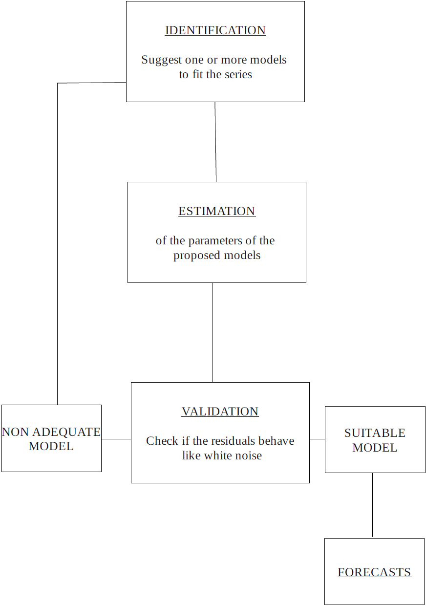

```{r setup, include=FALSE}
library(zoo)
```

# Introduction

This project aims to apply the Box-Jenkins ARIMA methodology to analyze and predict a chosen “real-time series.” 
Specifically, we have selected the TurMatric.dat time series. This dataset contains monthly data on the number of 
registered cars in Spain from January 1990 to December 2019. It is provided by the Ministerio de Fomento: http://www.fomento.gob.es.

# Explanation of the Box-Jenkins Methodology

The Box-Jenkins methodology is a structured approach to time series modeling and forecasting. 
It consists of the four main steps outlined below, which we will explain in greater detail in the following sections.

- `Identification`
- `Estimation`
- `Validation`
- `Prediction`



## Identification

The identification step in the Box-Jenkins methodology involves determining the appropriate structure of the ARIMA model by analyzing 
the characteristics of the time series. The first task is to check whether the data is stationary, as ARIMA models require stationarity 
for effective modeling. If the series exhibits trends or seasonal patterns, transformations such as differencing (to remove trends) or
applying logarithms (to stabilize variance) may be necessary. Once the series is stationary, the autocorrelation function (ACF) and 
partial autocorrelation function (PACF) plots are examined to identify the potential orders of the autoregressive (AR) and moving average 
(MA) components. Additionally, seasonal patterns, if present, may require extending the model to a Seasonal ARIMA (SARIMA) by including seasonal 
differencing and seasonal AR or MA components. The goal of this step is to hypothesize an initial model structure that will be refined in later stages.

Stationary data:<br>
Stationary data refers to a time series whose statistical properties, such as mean, variance, and autocorrelation, remain constant over time. 
In other words, the data does not exhibit trends, seasonal effects, or changes in variability over time. 
The three main steps we cover to transform our data into stationarity are: change of scale, applying a seasonal and regular difference. These will be explained
in more detail later. 

ACF and PACF:<br>
The ACF measures the relationship between the two k-lag apart variables \( X_t \) and \( X_{t+k} \). It lies between -1 and +1 and falls immediately from 1 to 0 under stationary.
The PACF is similar to the ACF but measures the relationship between two variables after excluding the effect of one or more independent variables.
We utilize the ACF and PACF to identify the parameters p, q and P, Q for our SARIMA models.

## Estimation

After selecting the appropriate model structure (i.e., the values for p, d, and q), the next task is to estimate the parameters 
that best fit the model to the historical data. This is typically done using maximum likelihood estimation (MLE), 
a statistical method that finds the parameter values that maximize the likelihood of observing the given data under the model. 
In ARIMA models, this means estimating the coefficients for the autoregressive (AR) terms, the moving average (MA) terms, and
the variance of the error term. During this process, it's important to check the model's goodness-of-fit using measures, such as AIC (Akaike Information Criterion) or 
BIC (Bayesian Information Criterion), to help select the best-fitting model.

## Validation

The validation step in the Box-Jenkins methodology involves evaluating the adequacy of the fitted model by examining the residuals,
or the errors between the observed and predicted values. The goal is to ensure that the residuals behave like white noise, meaning 
they should be random, uncorrelated, and have a mean of zero. If the residuals display patterns or correlations, the model may not be appropriate, 
and adjustments might be necessary. In particular, we use the following methods to validate our identified models:

- `Homogeneity of Variance / Constant Variance`
  - Residuals plot
  - Square Root of Absolute Residuals plot
  - ACF and PACF of Square of Residuals plots
- `Normality`
  - Normal Q-Q (Quantile-Quantile) plot
  - Histogram of Residuals (with theoretical density overlapped)
  - Shapiro-Wilk test
- `Independence`
  - ACF and PACF of Square of Residuals plots
  - Llung-Box test and p-values for Llung-Box statistic plot
  - Durbin-Watson test

If the model passes these diagnostic checks, it indicates that the fitted model is a good representation of the underlying data. 
If issues are detected, further refinement of the model is needed, such as revisiting the model identification or estimation steps.

## Prediction

The prediction step in the Box-Jenkins methodology involves using the validated ARIMA model to generate forecasts for 
future values of the time series. The model's parameters, which were estimated during the earlier steps, 
are used to extrapolate future values based on the historical data. Forecasts can be made for various time horizons, and they are typically 
accompanied by confidence intervals, which provide a range of possible outcomes based on the model’s uncertainty.


# Box-Jenkins Methodology applied to the TurMatric.dat Time Series

First, we read our time series data. Please note that we change the scale of the values to thousands.

```{r echo=FALSE}
serie <- ts(read.table("TurMatric.dat") / 1000, start = 1990, freq = 12)
plot(serie, main = "Registered cars in Spain", ylab = "Thousands of Units")
abline(v = 1990 : 2020, lty = 3, col = 4)
```

## Identification
### Change of scale

In the initial step of identification, we examine the scale of our data to ensure constant variance, a critical condition for stationarity. To assess the variance of the time series, we use a box plot and a mean-variance plot of the yearly data. While the box plot is challenging to interpret and does not clearly indicate an increase in variance with higher means, the mean-variance plot provides a clearer perspective. It reveals that the variance increases as the average mean values rise. Consequently, a change of scale is required.

```{r echo=FALSE}
# Create the box-plot and mean ~ variance plot of the original data
boxplot(serie ~ floor(time(serie)), xlab = "Year", ylab = "Values",
        main = "Box-plot of the orginal data")
m <- apply(matrix(serie, nr=12), 2, mean)
v <- apply(matrix(serie, nr=12), 2, var)
plot(v~m, xlab = "Average mean", ylab = "Average variance", main = "Mean vs. Variance")
abline(lm(v~m),col=2,lty=3)
```

First, we rescale our data using the standard method by applying a logarithmic transformation. We then evaluate the variance of the rescaled data using a box plot and a mean-variance plot. In the mean-variance plot, the variance appears more consistent compared to the original data. However, the linear trend indicated by the red line reveals a slight decrease in variance for larger mean values. As a result, we propose applying an additional transformation to further stabilize the variance.

```{r echo=FALSE}
# Apply the logarithm to the data
lnserie <- log(serie)

# Create the box-plot and mean ~ variance plot of the log data
boxplot(lnserie ~ floor(time(lnserie)), xlab = "Year", ylab = "Values",
        main = "Box-plot of the log data")
m <- apply(matrix(lnserie, nr=12), 2, mean)
v <- apply(matrix(lnserie, nr=12), 2, var)
plot(v~m, xlab = "Average mean", ylab = "Average variance", main = "Mean vs. Variance")
abline(lm(v~m),col=2,lty=3)
```

Finally, we apply the Box-Cox transformation to our data:
\[ X_{new} = \frac{X^\lambda - 1}{\lambda} \]
 
Through trial and error, we determined that the transformation works best with a lambda value of 0.27. This transformation successfully achieves constant variance in the data.

```{r echo=FALSE}
# Apply box-cox transformation to data
lambda <- 0.27
box_cox_serie <- (serie^lambda - 1) / lambda

# Create the box-plot and mean ~ variance plot of the transformed data
boxplot(box_cox_serie ~ floor(time(lnserie)), xlab = "Year", ylab = "Values",
        main = "Box-plot of the box-cox data")
m <- apply(matrix(box_cox_serie, nr=12), 2, mean)
v <- apply(matrix(box_cox_serie, nr=12), 2, var)
plot(v~m, xlab = "Average mean", ylab = "Average variance", main = "Mean vs. Variance")
abline(lm(v~m),col=2,lty=3)
```

### Seasonal Difference

Next, we analyze the seasonality of the data. Given that the dataset is monthly, the presence of a seasonal pattern is highly likely. To identify this pattern, we begin by creating a month plot. This reveals that the means for different months vary significantly, clearly indicating a seasonal component. Additionally, we plot the data for each year separately and observe that the yearly patterns are consistent, further confirming the presence of seasonality. These findings suggest that applying a seasonal difference to the data is necessary.

```{r echo=FALSE}
monthplot(box_cox_serie, main = "Monthplot of the box-cox data", xlab = "Month", ylab = "Value")
ts.plot(matrix(box_cox_serie, nrow = 12), col = 1:8, xlab = "Month", ylab = "Value",
        main = "Yearly data")
```

To address the seasonal pattern, we applied a seasonal difference of 12. We then reexamined the data by displaying the month plot and the yearly trends. These plots confirm that the seasonal pattern has been effectively removed, as no visible seasonality remains.

```{r echo=FALSE}
# Apply the seasonal difference
d12_box_cox_serie <- diff(box_cox_serie, 12)
plot(d12_box_cox_serie, main = "Seasonal adjusted box-cox data", ylab = "Value")
abline(h = 0)

monthplot(d12_box_cox_serie, xlab = "Month", ylab = "Value",
          main = "Monthplot of the seasonal adjusted box-cox data")
ts.plot(matrix(d12_box_cox_serie, nrow = 12), col = 1:8, xlab = "Month", ylab = "Value",
        main = "Yearly data")
```

### Regular Difference

In the next step, we assess whether the mean of the data is constant. To do this, we plot the rolling mean of our seasonally adjusted data. It is evident that the mean is not constant, indicating the need for at least one regular difference.

```{r echo=FALSE}
rolling_mean <- rollmean(d12_box_cox_serie, k = 36, fill = NA)
plot(d12_box_cox_serie, main = "Rolling mean for seasonal adjusted box-cox data", ylab = "Values", xlab = "Time")
lines(rolling_mean, col = "red", lwd = 2)
```

After applying a regular difference, we observe that the rolling mean has become approximately constant.

```{r echo=FALSE}
# First regular difference applied to the data
d1_d12_box_cox_serie <- diff(d12_box_cox_serie)
rolling_mean <- rollmean(d1_d12_box_cox_serie, k = 36, fill = NA)
plot(d1_d12_box_cox_serie, main = "Rolling mean for seasonal adjusted box-cox data", ylab = "Values", xlab = "Time")
lines(rolling_mean, col = "red", lwd = 2)
```

To determine the number of differences required for the data, we assess its variance. We observe that the variance decreases after applying the first regular difference but increases again when a second difference is applied. Consequently, we apply only one regular difference, which successfully achieves stationarity for the time series.

```{r echo=FALSE}
var(d12_box_cox_serie)
var(d1_d12_box_cox_serie)
var(diff(d1_d12_box_cox_serie))
```

### ACF and PACF

After transforming our data to achieve stationarity, we next analyzed the ACF and PACF of the time series to identify possible models. Since we applied a seasonal difference of 12 and one regular difference, we can already set the parameters as \(d = 1\), \(D = 1\), and a period of 12.

```{r echo=FALSE}
par(mfrow=c(1,2))
acf(d1_d12_box_cox_serie, ylim = c(-1, 1), col = c(2, rep(1, 11)), lwd = 2,
    lag.max = 60, main = "ACF", ylab = "Value")
pacf(d1_d12_box_cox_serie, ylim = c(-1, 1), col = c(rep(1, 11), 2), lwd = 2,
     lag.max = 60, main = "PACF", ylab = "Value")
par(mfrow=c(1,1))
```

To identify a potential AR(p) model, we primarily focus on the PACF. The value of p is determined by identifying the last significant non-zero lag. We conclude this occurs at lag 2, as the subsequent lags, with the exception of lag 6, fall within the confidence bands, suggesting their values are effectively zero. For identifying potential MA(q) models, we focus on the ACF. The value of q is determined by identifying the last significant non-zero lag, excluding the first lag (which always has a value of 1). Based on this analysis, we consider lag 1 as the last significant lag, since subsequent lags remain within the confidence bands.
Since the ACF and PACF do not provide a clear indication of either an AR or MA model, we also consider an ARMA(1,1) model. To identify the seasonal parameters, we again examine the ACF and PACF. In both cases, the first seasonal lag is the last significant one, suggesting possible seasonal parameters of P=1 and Q=1.

Using the parameters identified above, we can combine them to form six potential model configurations:<br>
Seasonal parameter P=1, Q=0:<br>
- `ARIMA(2, 1, 0)(1, 1, 0)[12]`
- `ARIMA(0, 1, 1)(1, 1, 0)[12]`
- `ARMA(1, 1, 1)(1, 1, 0)[12]`

Seasonal parameter P=0, Q=1:<br>
- `ARIMA(2, 1, 0)(0, 1, 1)[12]`
- `ARIMA(0, 1, 1)(0, 1, 1)[12]`
- `ARMA(1, 1, 1)(0, 1, 1)[12]`

## Estimation

In this section, we estimate the six identified models. For brevity, we include only the estimation of Model 1 in the report, while the estimations for the other five models are provided in the source code. This approach is justified as the validation of all six models yielded similar results.

Model 1:

```{r echo=FALSE}
#Model 1: ARIMA(2, 1, 0)(1, 1, 0)[12]
(model1 <- arima(d1_d12_box_cox_serie, order = c(2, 1, 0),
               seasonal = list(order = c(1, 1, 0), period = 12)))
cat("\nT-ratios:",round(model1$coef/sqrt(diag(model1$var.coef)),2))
cat("\nSignificant?:",abs(model1$coef/sqrt(diag(model1$var.coef)))>2)
```

```{r include=FALSE}
#Model 2: ARIMA(0, 1, 1)(1, 1, 0)[12]
(model2 <- arima(d1_d12_box_cox_serie, order = c(0, 1, 1),
               seasonal = list(order = c(1, 1, 0), period = 12)))
cat("\nT-ratios:",round(model2$coef/sqrt(diag(model2$var.coef)),2))
cat("\nSignificant?:",abs(model2$coef/sqrt(diag(model2$var.coef)))>2)

#Model 3: ARMA(1, 1, 1)(1, 1, 0)[12]
(model3 <- arima(d1_d12_box_cox_serie, order = c(1, 1, 1),
               seasonal = list(order = c(1, 1, 0), period = 12)))
cat("\nT-ratios:",round(model3$coef/sqrt(diag(model3$var.coef)),2))
cat("\nSignificant?:",abs(model3$coef/sqrt(diag(model3$var.coef)))>2)

#Model 4: ARIMA(2, 1, 0)(0, 1, 1)[12]
(model4 <- arima(d1_d12_box_cox_serie, order = c(2, 1, 0),
               seasonal = list(order = c(0, 1, 1), period = 12)))
cat("\nT-ratios:",round(model4$coef/sqrt(diag(model4$var.coef)),2))
cat("\nSignificant?:",abs(model4$coef/sqrt(diag(model4$var.coef)))>2)

#Model 5: ARIMA(0, 1, 1)(0, 1, 1)[12]
(model5 <- arima(d1_d12_box_cox_serie, order = c(0, 1, 1),
               seasonal = list(order = c(0, 1, 1), period = 12)))
cat("\nT-ratios:",round(model5$coef/sqrt(diag(model5$var.coef)),2))
cat("\nSignificant?:",abs(model5$coef/sqrt(diag(model5$var.coef)))>2)

#Model 6: ARMA(1, 1, 1)(0, 1, 1)[12]
(model6 <- arima(d1_d12_box_cox_serie, order = c(1, 1, 1),
               seasonal = list(order = c(0, 1, 1), period = 12)))
cat("\nT-ratios:",round(model6$coef/sqrt(diag(model6$var.coef)),2))
cat("\nSignificant?:",abs(model6$coef/sqrt(diag(model6$var.coef)))>2)
```

## Validation

For validation purposes, we reuse the function provided in the exercises. The corresponding code can be found in the source code. The explanation of the validation results for Model 1 are representative for the results for all models from 1 to 6.

```{r include=FALSE}
# Validation process in one function
validation = function(model) {

  s = frequency(get(model$series))
  resi = model$residuals
  par(mfrow = c(2, 2), mar = c(3, 3, 3, 3))

  # Residuals plot
  plot(resi, main = "Residuals")
  abline(h = 0)
  abline(h = c(-3 * sd(resi), 3 * sd(resi)), lty = 3, col = 4)

  # Square Root of absolute values of residuals (Homocedasticity)
  scatter.smooth(sqrt(abs(resi)), main = "Square Root of Absolute residuals",
                 lpars = list(col = 2))

  # Normal plot of residuals
  qqnorm(resi)
  qqline(resi, col = 2, lwd = 2)

  # Histogram of residuals with normal curve
  hist(resi, breaks = 20, freq = FALSE)
  curve(dnorm(x, mean = mean(resi), sd = sd(resi)), col = 2, add = T)

  # ACF & PACF of residuals
  par(mfrow = c(1, 2))
  acf(resi, ylim = c(-1, 1), lag.max = 60, col = c(2, rep(1, s - 1)), lwd = 2)
  pacf(resi, ylim = c(-1, 1), lag.max = 60, col = c(rep(1, s - 1), 2), lwd = 2)
  par(mfrow = c(1, 1))

  # Ljung-Box p-values
  par(mar = c(2, 2, 1, 1))
  tsdiag(model, gof.lag = 7 * s)
  cat("\n-------------------------------------------------------------------\n")
  print(model)

  # Stationary and invertible
  cat("\nModul of AR Characteristic polynomial Roots: ", 
      Mod(polyroot(c(1, -model$model$phi))), "\n")
  cat("\nModul of MA Characteristic polynomial Roots: ",
      Mod(polyroot(c(1, model$model$theta))), "\n")

  suppressMessages(require(forecast, quietly = TRUE, warn.conflicts = FALSE))
  plot(model)

  # Model expressed as an MA infinity (psi-weights)
  psis = ARMAtoMA(ar = model$model$phi, ma = model$model$theta, lag.max = 36)
  names(psis) = paste("psi", 1 : 36)
  cat("\nPsi-weights (MA(inf))\n")
  cat("\n---------------------\n")
  print(psis[1 : 24])

  # Model expressed as an AR infinity (pi-weights)
  pis = -ARMAtoMA(ar = -model$model$theta, ma = -model$model$phi, lag.max = 36)
  names(pis) = paste("pi", 1 : 36)
  cat("\nPi-weights (AR(inf))\n")
  cat("\n--------------------\n")
  print(pis[1 : 24])

  cat("\nDescriptive Statistics for the Residuals\n")
  cat("\n----------------------------------------\n") 

  suppressMessages(require(fBasics, quietly = TRUE, warn.conflicts = FALSE))

  # Anderson-Darling test
  print(basicStats(resi))

  # Add here complementary tests
  # ---------------------------------------------------------
  cat("\nNormality Tests\n")
  cat("\n---------------\n")

  # Shapiro-Wilk Normality test
  print(shapiro.test(resi))

  suppressMessages(require(nortest, quietly = TRUE, warn.conflicts = FALSE))

  # Anderson-Darling test
  print(ad.test(resi))

  suppressMessages(require(tseries, quietly = TRUE, warn.conflicts = FALSE))

  # Jarque-Bera test
  print(jarque.bera.test(resi))

  cat("\nHomoscedasticity Test\n")
  cat("\n---------------------\n")
  suppressMessages(require(lmtest, quietly = TRUE, warn.conflicts = FALSE))

  # Breusch-Pagan test
  obs = get(model$series)
  print(bptest(resi ~ I(obs - resi)))

  cat("\nIndependence Tests\n")
  cat("\n------------------\n")

  # Durbin-Watson test
  print(dwtest(resi ~ I(1 : length(resi))))
  
  # Ljung-Box test
  cat("\nLjung-Box test\n")
  print(t(apply(matrix(c(1 : 4, (1 : 4) * s)), 1, function(el) {
    te = Box.test(resi, type = "Ljung-Box", lag = el)
    c(lag = (te$parameter), statistic = te$statistic[[1]], p.value = te$p.value)})))
}
```

```{r}
validation(model1)
```

We observe that the ACF and PACF of the residuals often fall outside the confidence bands, suggesting that the autocorrelation of the residuals is high. This is further supported by the Ljung-Box statistic, where all p-values are below the required threshold, preventing us from rejecting the hypothesis that the residuals are not autocorrelated. On the other hand, the residuals plot, the square root of the absolute residuals, the normal Q-Q plot, and the histogram of the residuals appear acceptable. These plots are used to assess the homogeneity of variance and the normality of the residuals. We will examine these plots in more detail for the further models we will select.


```{r include=FALSE}
# Validation of model 2-6
validation(model2)
validation(model3)
validation(model4)
validation(model5)
validation(model6)
```

### Identification, Validation and Estimation of Better Models

Because models 1-6 exhibited significant shortcomings during the validation process, we decided to identify additional models with different parameters. The first model we identified is an MA(12), as the analysis of the ACF reveals that the last significant lag is 12. Additionally, we chose an ARMA(2,2) model to increase the number of parameters, assess the performance of an ARMA model, and because the ACF and PACF did not provide strong evidence favoring either an AR or MA model exclusively.

It’s fair to say that we encountered some challenges during the validation process, which made it difficult to find an ideal model for the chosen time series. With the Models 7 and 8 we tried and managed to achieve better results than before but also recognize that there may still be better models to explore.

Model 7:
```{r echo=FALSE}
#Model 7: ARIMA(0, 1, 12)(0, 1, 1)[12]
(model7 <- arima(d1_d12_box_cox_serie, order = c(0, 1, 12),
               seasonal = list(order = c(0, 1, 1), period = 12)))
cat("\nT-ratios:",round(model7$coef/sqrt(diag(model7$var.coef)),2))
cat("\nSignificant?:",abs(model7$coef/sqrt(diag(model7$var.coef)))>2)
```

Model 8:
```{r echo=FALSE}
#Model 8: ARMA(2, 1, 2)(0, 1, 1)[12]
(model8 <- arima(d1_d12_box_cox_serie, order = c(2, 1, 2),
               seasonal = list(order = c(0, 1, 1), period = 12)))
cat("\nT-ratios:",round(model8$coef/sqrt(diag(model8$var.coef)),2))
cat("\nSignificant?:",abs(model8$coef/sqrt(diag(model8$var.coef)))>2)
```

```{r}
validation(model7)
```

In the validation process for Model 7, we observed better results compared to the previous Models (1-6). The residuals plot and the square root of absolute residuals plot show noticeable improvements. Additionally, the ACF and PACF of the residuals are rarely outside of the confidence bands, suggesting that the variance is now constant. While the normal Q-Q plot and histogram of the residuals are not perfect, this is to be expected when working with real-life data. However, they are significantly better than those observed for models 1-6, indicating that a normal distribution is more likely.

Regarding the independence of the data, the ACF and PACF of the squared residuals, as well as the Ljung-Box test and its p-values, show that the first 10 to 11 values are above the necessary threshold. Although we couldn’t find a model where more p-values exceeded this threshold, we are satisfied with the autocorrelation results we achieved here.

```{r}
validation(model8)
```

In the validation process for Model 8, we observed results similar to those of Model 7, showing improvements over Models 1-6. The residuals plot and the square root of absolute residuals plot appear acceptable. Additionally, the ACF and PACF of the residuals consistently stay within the confidence bands, which was expected, indicating that the variance is constant. While the normal Q-Q plot and the histogram of the residuals are not ideal, they are significantly better than those for Models 1-6, suggesting the presence of a normal distribution.

Regarding the independence of the data, the ACF and PACF of the squared residuals, along with the Ljung-Box test and its p-values, show that the first 10 to 11 values are above the required threshold. Similar to the validation of Model 7, we are satisfied with the autocorrelation results observed here.

### AR and MA infinite models analysis

For the analysis of the AR and MA infinite models for Models 7 and 8, we examine the plots showing the inverse AR and MA roots. For a model to be invertible, all inverse MA roots must lie inside the unit circle. Additionally, for a model to be causal / stationary, all inverse AR roots must be inside the unit circle too.

Since Model 7 has no autoregressive component, causality is not a concern. However, the inverse MA roots of Model 7 lie on the unit circle, indicating that it is not invertible.

For Model 8, all inverse AR roots lie inside the unit circle, which means the model is causal and stationary. However, the inverse MA roots are on the unit circle, indicating that Model 8 is not invertible.


### Stability and capability of predicting check

To assess the stability of the proposed models and evaluate their predictive capabilities, we reserve the last 12 observations. This enables us to use both models to forecast these final 12 values and compare them with the actual values of the time series. In the "Best Model Selection" section, we will compare the two models using various performance metrics.

```{r include=FALSE} 
# Function to reverse the initial data transformation
reverse_transformation <- function(ts_data) {
  # Reverse regular difference
  recovered_seasonal_serie <- ts(c(d12_box_cox_serie[1], cumsum(ts_data) + d12_box_cox_serie[1]),
                       start = start(d12_box_cox_serie), frequency = 12)
  
  # Reverse seasonal difference
  recovered_box_cox_serie <- numeric(length(recovered_seasonal_serie)+ 12)
  recovered_box_cox_serie[1:12] <- box_cox_serie[1:12]
  for (i in (12 + 1):length(recovered_box_cox_serie)) {
    recovered_box_cox_serie[i] <- recovered_seasonal_serie[i - 12] + recovered_box_cox_serie[i - 12]
  }
  recovered_box_cox_serie <- ts(recovered_box_cox_serie, start = start(box_cox_serie), frequency = 12)
  
  # Reverse Box-Cox transformation
  recovered_serie <- (recovered_box_cox_serie * lambda + 1)^(1 / lambda)
  
  return(recovered_serie)
}
```

Predictions for the last 12 observations using Model 7 (ARIMA(0, 1, 12)(0, 1, 1)[12]):

```{r include=FALSE}
ultim <- c(2018, 12)

# Split the data
serie1 <- window(d1_d12_box_cox_serie, end=ultim+c(1,0))
serie2 <- window(d1_d12_box_cox_serie, end=ultim)

# Use parameters of model 7
pdq <- c(0,1,12)
PDQ <- c(0,1,1)
(model7B=arima(serie2,order=pdq,seasonal=list(order=PDQ,period=12)))
pred=predict(model7B, n.ahead=12)

model7B_pr <- ts(c(serie2,pred$pred),start=start(serie2),freq=12)
model7B_tl <- ts(c(serie2,pred$pred-1.96*pred$se),start=start(serie2),freq=12)
model7B_tu <- ts(c(serie2,pred$pred+1.96*pred$se),start=start(serie2),freq=12)

pr <- reverse_transformation(model7B_pr)
tl <- reverse_transformation(model7B_tl)
tu <- reverse_transformation(model7B_tu)
```

```{r echo=FALSE}
ts.plot(serie,tail(tl, 12),tail(tu, 12),tail(pr, 12),lty=c(1,2,2,1),
        col=c(1,4,4,2),xlim=ultim[1]+c(-1,+2),type="o",
        main="Prediction with confidence intervals")
abline(v=(ultim[1]-2):(ultim[1]+2),lty=3,col=4)
ts.plot(serie,tail(pr, 12),lty=c(1,1),
        col=c(1,2),xlim=ultim[1]+c(-1,+2),type="o",
        main="Prediction without confidence intervals")
abline(v=(ultim[1]-2):(ultim[1]+2),lty=3,col=4)
```

```{r include=FALSE}
obs <- window(serie,start=ultim+c(0,1))
pr <- window(pr,start=ultim+c(0,1))
ts(data.frame(LowLim=tail(tl,12),Predic=pr,UpperLim=tail(tu,12),Observ=obs,Error=obs-pr,PercentError=(obs-pr)/obs),start=ultim+c(0,1),freq=12)
mod.RMSE1=sqrt(sum((obs-pr)^2)/12)
mod.MAE1=sum(abs(obs-pr))/12
mod.RMSPE1=sqrt(sum(((obs-pr)/obs)^2)/12)
mod.MAPE1=sum(abs(obs-pr)/obs)/12
mCI1 <- mean(tu-tl)
```

Predictions for the last 12 observations using Model 8 (ARMA(2, 1, 2)(0, 1, 1)[12]):

```{r include=FALSE}
# Use parameters of model 8
pdq <- c(2,1,2)
PDQ <- c(0,1,1)
(model8B=arima(serie2,order=pdq,seasonal=list(order=PDQ,period=12)))
pred=predict(model8B, n.ahead=12)

model8B_pr <- ts(c(serie2,pred$pred),start=start(serie2),freq=12)
model8B_tl <- ts(c(serie2,pred$pred-1.96*pred$se),start=start(serie2),freq=12)
model8B_tu <- ts(c(serie2,pred$pred+1.96*pred$se),start=start(serie2),freq=12)

pr <- reverse_transformation(model8B_pr)
tl <- reverse_transformation(model8B_tl)
tu <- reverse_transformation(model8B_tu)
```

```{r echo=FALSE}
ts.plot(serie,tail(tl, 12),tail(tu, 12),tail(pr, 12),lty=c(1,2,2,1),
        col=c(1,4,4,2),xlim=ultim[1]+c(-1,+2),type="o",
        main="Prediction with confidence intervals")
abline(v=(ultim[1]-2):(ultim[1]+2),lty=3,col=4)
ts.plot(serie,tail(pr, 12),lty=c(1,1),
        col=c(1,2),xlim=ultim[1]+c(-1,+2),type="o",
        main="Prediction without confidence intervals")
abline(v=(ultim[1]-2):(ultim[1]+2),lty=3,col=4)
```

The analysis of the plots above shows that the predictions for the last 12 observations are quite accurate and closely align with the original values for both models. However, it is also evident that the confidence intervals are quite wide. This suggests a potential model misfit, which is consistent with the findings from the model validation phase, where we were unable to fully validate a suitable model for the data.

```{r include=FALSE}
obs <- window(serie,start=ultim+c(0,1))
pr <- window(pr,start=ultim+c(0,1))
ts(data.frame(LowLim=tail(tl,12),Predic=pr,UpperLim=tail(tu,12),Observ=obs,Error=obs-pr,PercentError=(obs-pr)/obs),start=ultim+c(0,1),freq=12)
mod.RMSE2=sqrt(sum((obs-pr)^2)/12)
mod.MAE2=sum(abs(obs-pr))/12
mod.RMSPE2=sqrt(sum(((obs-pr)/obs)^2)/12)
mod.MAPE2=sum(abs(obs-pr)/obs)/12
mCI2 <- mean(tu-tl)
```

### Best model selection

For forecasting purposes, it is essential to select the best model. To identify the most suitable model, we use the following performance metrics to assess the accuracy of the model's predictions:

- `Root Mean Square Error (RMSE): Measures the average squared error`
- `Mean Absolute Error (MAE): Measures the average absolute error`
- `Root Mean Square Percentage Error (RMSPE): Measures relative error as a percentage`
- `Mean Absolute Percentage Error (MAPE): Measures the average relative error as a percentage`

The results show that Model 7 consistently outperforms Model 8 across all performance metrics, achieving lower error scores. Additionally, Model 7 exhibits lower values for AIC and BIC, which reflect a better balance between model fit and complexity. As a result, we select Model 7 as the best model.

```{r echo=FALSE}
result <- data.frame(
  par=c(length(coef(model7)),length(coef(model8))),
  Sigma2Z=c(model7$sigma2,model8$sigma2),
  AIC=c(AIC(model7),AIC(model8)),
  BIC=c(BIC(model7),BIC(model8)),
  RMSE=c(mod.RMSE1,mod.RMSE2),
  MAE=c(mod.MAE1,mod.MAE2),
  RMSPE=c(mod.RMSPE1,mod.RMSPE2),
  MAPE=c(mod.MAPE1,mod.MAPE2),
  meanLength=c(mCI1,mCI2)
  )
row.names(result)=c("ARIMA(0,1,12)(0,1,1)12","ARMA(2,1,2)(0,1,1)12")
result
```

## Predictions

In this final section, we generate long-term forecasts for the twelve months following the most recent observation available for our selected model. Additionally, we include confidence intervals to accompany the predictions, providing a range of possible values to reflect the uncertainty of the forecast.

```{r echo=FALSE}
pred=predict(model7, n.ahead=12)

model7_pr <- ts(c(serie1,pred$pred),start=start(serie1),freq=12)
model7_tl <- ts(c(serie1,pred$pred-1.96*pred$se),start=start(serie1),freq=12)
model7_tu <- ts(c(serie1,pred$pred+1.96*pred$se),start=start(serie1),freq=12)

pr <- reverse_transformation(model7_pr)
tl <- reverse_transformation(model7_tl)
tu <- reverse_transformation(model7_tu)

ts.plot(serie,tail(tl, 13),tail(tu, 13),tail(pr, 13),lty=c(1,2,2,1),
        col=c(1,4,4,2),xlim=ultim[1]+c(-1,+3),type="o",
        main="Future predictions with conf. int.")
abline(v=(ultim[1]-1):(ultim[1]+3),lty=3,col=4)
ts.plot(serie,tail(pr, 13),lty=c(1,1),
        col=c(1,2),xlim=ultim[1]+c(-1,+3),type="o",
        main="Future predictions w.o. conf. int.")
abline(v=(ultim[1]-1):(ultim[1]+3),lty=3,col=4)
```

# Conclusion

In the report above, we successfully transformed the data into a stationary form by adjusting the scale, applying a seasonal difference, and a regular difference. Next, we identified potential SARIMA models based on the ACF and PACF plots. We then estimated these models and proceeded with their validation. Validation proved to be the most challenging step, as the plots and various tests were difficult to interpret. However, through careful analysis, we eventually proposed more complex models with additional parameters. We believe these models outperform the initial ones and used them to predict the last 12 observed values for the year 2019. Finally, we selected the best model based on specific performance measures and generated forecasts for the next 12 months.


